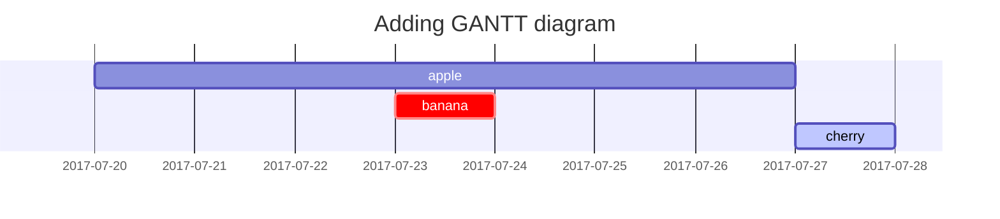

# Chirpy Post Writer

Write posts that conform to Chirpy's post format and Markdown features.

Treat this file as the working guide. Prefer its defaults unless the user, `AGENTS.md`, or repository conventions explicitly require something else.

## Workflow

1. Inspect the target repository before writing.
2. Read `AGENTS.md` if present.
3. If editing an existing post, preserve its structure, tone, and intentional deviations.
4. If creating a new post, inspect a few existing files in `_posts/` to match local conventions for language, categories, tags, media paths, and tone.
5. Draft the front matter first.
6. Write the article in plain Markdown first.
7. Add Chirpy-specific features only when they improve the result.
8. Run a final checklist before finishing.

## Create a New Post

Create the file in `_posts/` with the repository's required naming pattern. If the repository does not define one, use this default pattern:

```text
YYYY-MM-DD-title.md
```

Use `.md` by default. Chirpy also accepts `.markdown`.

If repository instructions require language-specific filenames such as `YYYY-MM-DD-jp-title.md`, follow that repository rule instead of the generic default.

Start from this front matter:

```yaml
---
title: TITLE
date: YYYY-MM-DD HH:MM:SS +/-TTTT
categories: [TOP_CATEGORY, SUB_CATEGORY]
tags: [tag]
---
```

Follow these rules:

- Include the timezone offset in `date`.
- Keep `tags` lowercase.
- Keep `categories` to one or two levels unless the repository clearly uses a different pattern.
- Do not add `layout: post`; Chirpy already defaults posts to the `post` layout.
- Add only fields that are needed for the post.

Use these optional fields when appropriate:

```yaml
---
author: <author_id>
authors: [<id1>, <id2>]
description: Short summary of the post.
toc: false
comments: false
pin: true
image: /path/to/image
media_subpath: /path/to/media/
math: true
mermaid: true
render_with_liquid: false
---
```

Apply them like this:

- Use `author` or `authors` to override the site default author.
- Use `description` when the opening paragraph is a weak excerpt or when a short custom summary is valuable.
- Use `toc: false` to disable the right-side table of contents for a single post.
- Use `comments: false` to disable comments for a single post.
- Use `pin: true` to pin a post on the home page.
- Use `image` to set the preview image.
- Use `media_subpath` to define a shared prefix for the post's media.
- Use `math: true` only when the post contains MathJax content.
- Use `mermaid: true` only when the post contains Mermaid diagrams.
- Use `render_with_liquid: false` when the post needs to display Liquid syntax literally.

If a post needs a custom author entry, define it in `_data/authors.yml`:

```yaml
<author_id>:
  name: <full name>
  twitter: <twitter_handle>
  url: <homepage_url>
```

Then reference it in front matter:

```yaml
---
author: <author_id>
# or
authors: [<author1_id>, <author2_id>]
---
```

## Edit or Polish a Post

When revising an existing post:

1. Preserve intentionally chosen front matter unless the user asks to normalize it.
2. Keep category and tag semantics intact.
3. Normalize obvious formatting issues:
   - inconsistent headings
   - malformed code fences
   - broken image syntax
   - missing feature flags such as `math: true` or `mermaid: true`
4. Improve excerpt quality with `description` only when useful.
5. Prefer small, local edits over full rewrites unless the user asks for a rewrite.

When converting notes into a polished article:

1. Infer a clear title.
2. Build minimal valid front matter.
3. Reorganize the notes into a logical heading structure.
4. Turn raw URLs, commands, examples, and screenshots into clean Markdown.
5. Add Chirpy features only where they add concrete value.

When repository instructions require multiple language versions:

1. Write the designated source-language version first.
2. Wait for the user to confirm that source version is complete if the repository workflow requires that pause.
3. Generate translated versions only after that checkpoint.
4. Add any repository-required translation notices or language tags.

## Media

### URL Prefix

Use `media_subpath` when many assets share the same path prefix:

```yaml
---
media_subpath: /path/to/media/
---
```

Compose final media URLs according to Chirpy rules:

```text
[site.cdn/][page.media_subpath/]file.ext
```

If `media_subpath` is set, preview image paths can often use only the filename.

### Images

Use a caption by placing italic text on the next line:

```markdown

_Image Caption_
```

Set dimensions when practical to reduce layout shift:

```markdown
{: width="700" height="400" }
```

Use shorthand if preferred:

```markdown
{: w="700" h="400" }
```

For SVG images, set at least the width.

Control position with these classes:

```markdown
{: .normal }
{: .left }
{: .right }
```

- `.normal` for left-aligned images
- `.left` for floating left
- `.right` for floating right

Do not add captions to positioned images.

Use theme-specific image variants like this:

```markdown
{: .light }
{: .dark }
```

Add a screenshot shadow like this:

```markdown
{: .shadow }
```

Use LQIP for regular images:

```markdown
{: lqip="/path/to/lqip-file" }
```

Use LQIP for preview images:

```yaml
---
image:
  path: /path/to/image
  alt: image alternative text
  lqip: /path/to/lqip-file
---
```

### Preview Image

Prefer a `1200 x 630` preview image.

Use the full form when you need `alt` or `lqip`:

```yaml
---
image:
  path: /path/to/image
  alt: alternative text
---
```

Use the short form when only the path matters:

```yaml
---
image: /path/to/image
---
```

### Embedded Media

Embed social media content with:

```liquid

```

Common supported platforms:

- `youtube`
- `twitch`
- `bilibili`
- `spotify`

Embed a video file with:

```liquid

```

Useful `embed/video.html` attributes:

- `poster`
- `title`
- `autoplay=true`
- `loop=true`
- `muted=true`
- `types='ogg|mov'`

Embed an audio file with:

```liquid

```

Useful `embed/audio.html` attributes:

- `title`
- `types='ogg|wav|aac'`

## Text and Typography

Use normal Markdown headings:

```markdown
# H1
## H2
### H3
#### H4
```

Use standard Markdown prose unless a Chirpy-specific presentation is needed.

Use lists as normal Markdown:

```markdown
1. Firstly
2. Secondly
3. Thirdly
```

```markdown
- Chapter
  - Section
    - Paragraph
```

Use task lists:
```markdown
- [ ] Job
- [x] Done item
```

Use description lists:
```markdown
Sun
: the star around which the earth orbits

Moon
: the natural satellite of the earth
```

Use block quotes:
```markdown
> This line shows the _block quote_.
```

Use Chirpy prompt boxes when callouts improve readability:
```markdown
> Tip content here.
{: .prompt-tip }
```

Available prompt classes:

- `{: .prompt-tip }`
- `{: .prompt-info }`
- `{: .prompt-warning }`
- `{: .prompt-danger }`

Use tables as normal Markdown tables:
```markdown
| Company    | Contact   | Country |
| :--------- | :-------- | ------: |
| Alfreds    | Maria     | Germany |
```

Use links in normal Markdown or angle-bracket form:
```markdown
<https://example.com>
[Link Text](https://example.com)
```

Use footnotes:
```markdown
Click to locate footnote[^footnote]

[^footnote]: The footnote source
```

Use inline code:
```markdown
`inline code`
```

Use Chirpy filepath highlighting when showing file paths in prose:
```markdown
`/path/to/file.ext`{: .filepath}
```

## Code Blocks

Use fenced code blocks:
````markdown
```text
code here
```
````

Specify the language for syntax highlighting:
````markdown
```yaml
key: value
```
````

Hide line numbers when they add noise:

````markdown
```bash
echo hello
```
{: .nolineno }
````

Show a filename with the `file` attribute:

````markdown
```yaml
key: value
```
{: file="_config.yml" }
````

Do not use Jekyll's `` tag; it is not compatible with this theme.

If the post must display Liquid code literally, wrap the block in `` and ``:

````markdown

```liquid


```

````

Alternatively, set `render_with_liquid: false` in front matter.

## Mathematics

Enable MathJax in front matter:

```yaml
---
math: true
---
```

Write block math with blank lines around the `$$` block:

```markdown
$$
\begin{equation}
  \sum_{n=1}^\infty 1/n^2 = \frac{\pi^2}{6}
  \label{eq:series}
\end{equation}
$$
```

Reference a labeled equation inline with `\eqref{eq:series}`.

Write inline math in prose like this:

```markdown
When $a \ne 0$, there are two solutions to $ax^2 + bx + c = 0$
```

Write inline math in list items by escaping the first dollar sign:

```markdown
1. \$$ a^2 + b^2 = c^2 $$
```

## Mermaid

Enable Mermaid in front matter:

```yaml
---
mermaid: true
---
```

Write diagrams with fenced Mermaid code blocks:

````markdown

````

## Default Decision Rules

Use these defaults unless local instructions override them:

- Prefer standard Markdown over Chirpy-specific syntax.
- Prefer minimal front matter over exhaustive front matter.
- Prefer one clear preview image over decorative media.
- Prefer `description` only when it improves the excerpt.
- Prefer lowercase tags.
- Prefer adding `math: true`, `mermaid: true`, and `render_with_liquid: false` only when required by the content.

## Final Checklist

Check these items before finishing:

1. Ensure the file path and filename are correct.
2. Ensure the front matter is valid YAML bounded by `---`.
3. Ensure `date` includes an explicit timezone offset.
4. Ensure `categories` and `tags` follow the intended convention.
5. Ensure every enabled feature has the required front matter flag.
6. Ensure image paths, embed IDs, and media paths are valid.
7. Ensure positioned images do not also use captions.
8. Ensure code fences are balanced and language tags are correct.
9. Ensure Liquid examples are wrapped safely or `render_with_liquid: false` is set.
10. Ensure math blocks keep required blank lines.
11. Ensure headings are ordered logically.
12. Ensure the opening section, title, and optional `description` agree.
13. Ensure the article reads naturally and matches the repository's language and tone.
