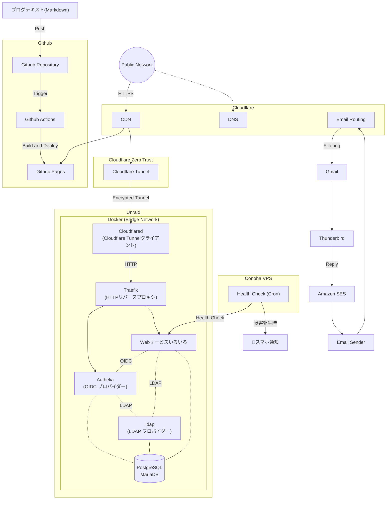

個人でProduction Readyレベルの自宅サーバーを構築・運用しておりおります。
特に、学習開始からわずか7日間で「AWS認定ソリューションアーキテクト – Associate」に合格できた背景には、数年間にわたる自宅サーバー運用で培ったインフラの基礎理解があったと自負しております。

## 自宅サーバー

数年前、Youtubeで自宅サーバーの動画を見て、興味を持ちました。
そして、Raspberry PiとAWS EC2から始めて、Linux、Docker、VMなどを学びました。
現在、自作PCで数十個のWebサービスを運用しています。

### Overview

_Unraid OS_

[Unraid OS](https://unraid.net/)を使用しています。
サービスは全部Docker Composeで運用しています。

_サービス一覧_

現在運用しているサービス：<https://home.forever17.me/>
白ボタン：誰でも認証なしで使えます
灰ボタン：使うには認証が必要です
黒ボタン：ローカルからしかアクセスできません
※一部ローカルからしかアクセスできないサービスをこのページに載せていません

### ネットワーク構造

### 工夫したところ①：ネットワーク構成

数年前にネットワークの基礎知識はありましたが、実際の応用した経験はありませんでしたので、自宅サーバー構築の初期はよくネットワーク問題で困ってました。
もともとはオンプレミス的な構成で、HTTPSの証明書管理もサーバーの方で行いました。
現在は一部の機能をクラウド(Cloudflare)に移行して、より簡単＆安全な構造に変更しました。

- 低コスト
  - 自宅サーバーのマシンと電気代以外コストなし
  - Cloudflareの無料プランしか使っていません
  - CDN、DDos保護、Tunnel全部無料
- 安全
  - [Cloudflare DNS Proxy](https://developers.cloudflare.com/dns/proxy-status/)を利用することで実際のサーバーIPが見れない
    - DDoS、AIロボットなども防げる
    - SSL/TLS証明書の管理とHTTPS通信もCloudflare側に全任せ
- SSOを利用してアカウント管理が簡単
  - サービスごとに認証システムがついていて、サービスごとにアカウント作成/管理が煩雑
  - SSOで統一すると、1アカウントですべてのサービスにログインできる
    - もちろん権限管理で使えるサービスと使えないサービスの設定もできる

### 工夫したところ②：Webサービスの選定

- クラウドに保存したいファイルが数TBぐらいあるが、Google ドライブお高いので、安く済ませたい
  - Google ドライブと同じようにブラウザでWordとExcel直接編集できる
- 複数人同時編集できるWebホワイトボードがほしい
- IT仕事でよく使うツールをまとめたサイトがほしい
- PDF編集・作成・変換したい
- Google Photoは写真を圧縮するので、圧縮しない写真保存サービスがほしい
- GithubのLFSの無料枠が少ないので、セルフホストのGitサービスがほしい
- 買いたい商品がいつも在庫切れで、在庫自動チェックボットがほしいが、そのためだけにコード書きたくない
- 脳内保存の３つのパスワードを使いまわしているので、安全性高めるためにパスワード管理サービスがほしい
  - TOTPとPasskeyなどもサポートしてほしい
- 上記の訴求は全部可能の限り0円で済ませたい

まるで自分自身に対してITコンサルタントしているような気分で、
Githubで漁ったり、記事を読んだり、実際に動かして試したりして、
最終的に顧客（自分）のニーズに合わせたものを実装するという流れが普段の娯楽です。

> 参考サイト
> <https://github.com/trending>
> <https://www.reddit.com/r/selfhosted/>
> <https://github.com/awesome-selfhosted/awesome-selfhosted>
> <https://www.linuxserver.io/>
{: .prompt-tip }

### 20260201更新

_TrueNASに移行しました。_
