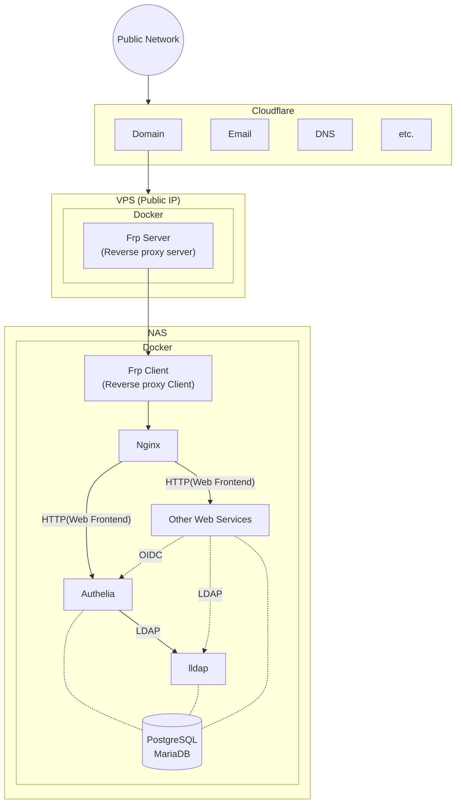

> この記事は、履歴書と職務経歴書の補足となるものです。  
> 一度履歴書と職務経歴書をご覧になった上で、本記事を閲覧することおすすめします。  
> 面接時の話題として使えたら幸いです。
{: .prompt-tip }
> この記事は随時更新していますので、ページがブラウザーにキャッシュされ、タイミングによって反映されない可能性はございます。  
> ご一読の前に必ずCtrl+F5(Chrome/Firefox)あるいはCtrl+R(Safari)で強制再読み込みをしてください。
{: .prompt-tip }

## 業務で実装したもの



個人的に結構気に入った実装、3D の部分に触れることが少ないですので。  



ショップ画面。細かいUI仕様が多く、且つ課金と関連しているので慎重に実装しました。  



新卒一年目のとき初めて担当した一画面。

※自分の実装後に改修された部分もあります。  

## 個人の趣味活動

### 自宅サーバー（NAS）

_Unraid OS_

完全自作PCです。[Unraid OS](https://unraid.net/)を使用しています。

※プライベート用のサービスも稼働していますのでDocker Containerの部分はモザイクでご了承ください。

自宅サーバーネットワーク構造です。

各種Web Servicesの認証システムを[Authelia(SSO)](https://www.authelia.com/)で統一して、パスワード管理を[lldap(LDAP)](https://github.com/lldap/lldap)に任せてアカウント管理の部分を簡潔にしました。

_提供中のサービス（一部）_

とにかくセルフホストするって感じです。
※他にMinecraftサーバーなどもあります。

_Drone(Github Action like CI/CD)_

このブログサイトも[Forgejo](https://forgejo.org/)で管理していて、[Drone(CI/CD)](https://www.drone.io/)でページをビルドしています。

### VRChat

過去にVRChatにはまった時期がありまして、オープンソースのShaderでいろいろギミック作ってました。



ステンシェルとビット演算を利用したパフォーマンス。



こちらもステンシェルで作ったギミックですが、暗い神社を表現するためにライティングの設定も細かく調整しました。



MMDのモーションを入れたり、躍らせてみました。
