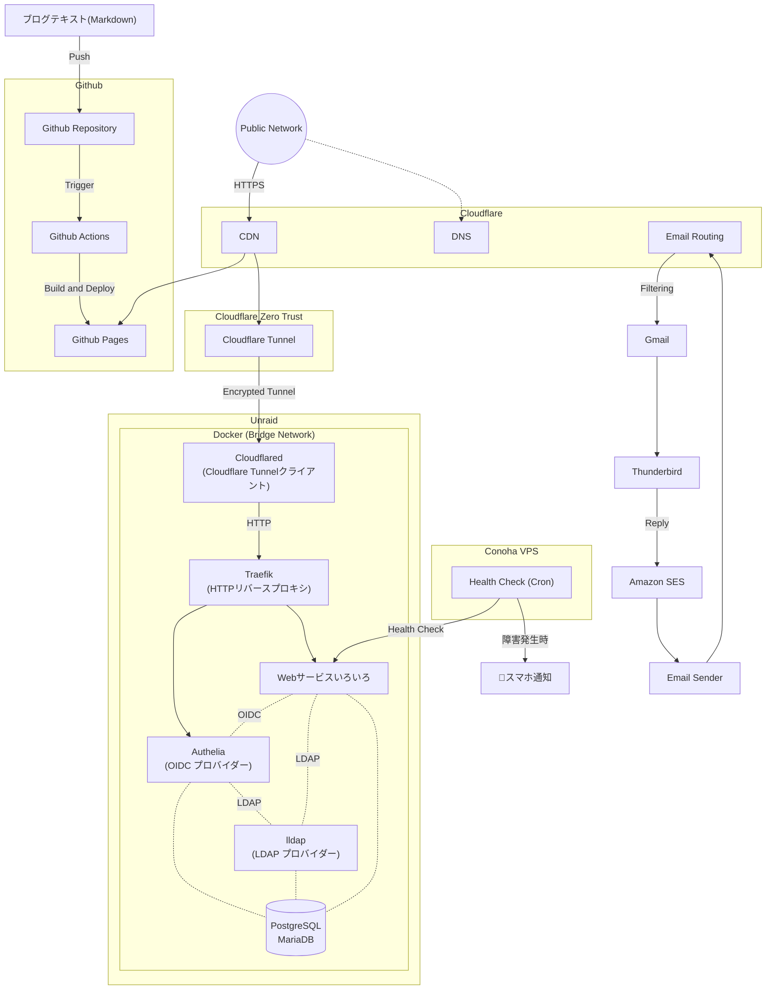

> この記事は、履歴書と職務経歴書の補足となるものです。
> 一度履歴書と職務経歴書をご覧いただいた上で、本記事をご覧いただけますと幸いです。
{: .prompt-tip }

ゲームクライアントエンジニアとして5年間勤務してまいりましたが、並行して個人でProduction Readyレベルの自宅サーバーを構築・運用しており、そちらの経験を活かしてインフラエンジニアへのキャリアチェンジを希望しております。
特に、学習開始からわずか7日間で「AWS認定ソリューションアーキテクト – Associate」に合格できた背景には、数年間にわたる自宅サーバー運用で培ったインフラの基礎理解があったと自負しております。

> 記事の後半に、面接でよく聞かれる話をまとめたQ&Aもあります。
> 面接がよりスムーズにすすめられますよう、ご一読ください。
{: .prompt-tip }

## 自宅サーバー

数年前、Youtubeで自宅サーバーの動画を見て、興味を持ちました。
そして、Raspberry PiとAWS EC2から始めて、Linux、Docker、VMなどを学びました。
現在、自作PCで数十個のWebサービスを運用しています。
今後は、この経験を活かして、インフラエンジニアとして働けたらと考えております。
ぜひご指導ご鞭撻のほどよろしくお願いします。

### Overview

_Unraid OS_

[Unraid OS](https://unraid.net/)を使用しています。
サービスは全部Docker Composeで運用しています。

_サービス一覧_

現在運用しているサービス：<https://home.forever17.me/>
白ボタン：誰でも認証なしで使えます
灰ボタン：使うには認証が必要です
黒ボタン：ローカルからしかアクセスできません
※一部ローカルからしかアクセスできないサービスをこのページに載せていません

### ネットワーク構造

### 工夫したところ①：ネットワーク構成

数年前にネットワークの基礎知識はありましたが、実際の応用した経験はありませんでしたので、自宅サーバー構築の初期はよくネットワーク問題で困ってました。
もともとはオンプレミス的な構成で、HTTPSの証明書管理もサーバーの方で行いました。
現在は一部の機能をクラウド(Cloudflare)に移行して、より簡単＆安全な構造に変更しました。

- 低コスト
  - 自宅サーバーのマシンと電気代以外コストなし
  - Cloudflareの無料プランしか使っていません
  - CDN、DDos保護、Tunnel全部無料
- 安全
  - [Cloudflare DNS Proxy](https://developers.cloudflare.com/dns/proxy-status/)を利用することで実際のサーバーIPが見れない
    - DDoS、AIロボットなども防げる
    - SSL/TLS証明書の管理とHTTPS通信もCloudflare側に全任せ
- SSOを利用してアカウント管理が簡単
  - サービスごとに認証システムがついていて、サービスごとにアカウント作成/管理が煩雑
  - SSOで統一すると、1アカウントですべてのサービスにログインできる
    - もちろん権限管理で使えるサービスと使えないサービスの設定もできる

### 工夫したところ②：Webサービスの選定

- クラウドに保存したいファイルが数TBぐらいあるが、Google ドライブお高いので、安く済ませたい
  - Google ドライブと同じようにブラウザでWordとExcel直接編集できる
- 複数人同時編集できるWebホワイトボードがほしい
- IT仕事でよく使うツールをまとめたサイトがほしい
- PDF編集・作成・変換したい
- Google Photoは写真を圧縮するので、圧縮しない写真保存サービスがほしい
- GithubのLFSの無料枠が少ないので、セルフホストのGitサービスがほしい
- 買いたい商品がいつも在庫切れで、在庫自動チェックボットがほしいが、そのためだけにコード書きたくない
- 脳内保存の３つのパスワードを使いまわしているので、安全性高めるためにパスワード管理サービスがほしい
  - TOTPとPasskeyなどもサポートしてほしい
- 上記の訴求は全部可能の限り0円で済ませたい

まるで自分自身に対してITコンサルタントしているような気分で、
Githubで漁ったり、記事を読んだり、実際に動かして試したりして、
最終的に顧客（自分）のニーズに合わせたものを実装するという流れが普段の娯楽です。

> 参考サイト
> <https://github.com/trending>
> <https://www.reddit.com/r/selfhosted/>
> <https://github.com/awesome-selfhosted/awesome-selfhosted>
> <https://www.linuxserver.io/>
{: .prompt-tip }

### 次のステップ

- OSを[TrueNAS](https://www.truenas.com/)への移行
- サーバー台数を増やして、[SeaweedFS](https://github.com/seaweedfs/seaweedfs)（分散型ファイルシステム）の導入を検討

---

## 面接でよく聞かれるQ&A

### Q: 転職の理由はなんですか？

成長を感じなくなったからです。
5年間ずっと同じプロジェクトで働き、最初の3年間はとても勉強になったと思いますが、
運営型のゲームですので、どうしても寿命が来てしまい、ここ2年は延命措置の実装しかしていません。
エンジニアは常に新しい技術を学び続ける必要があると思っています。

### Q: なぜゲームエンジニアからインフラエンジニアになりたいですか？

ゲーム業界から離れた理由：

5年間の経験を通じて、ゲームの「面白さ」について独自の理解と追求が生まれてきました。
ただ、会社組織の中で働きながら、自分が思い描く「面白さ」を追求していくことは難しいと感じるようになりました。
今後は、ゲーム制作を趣味として続けて、一種の芸術活動として取り組んでいきたいと考えております。

例えて言いますと、画家がずっと会社から依頼された絵ばかりを描いてきたけれど、ある日自分が本当に描きたいものが見つかった。
しかし、それは会社が求めているものとは違っていた、というような状況です。

インフラエンジニアになりたい理由：
過去にゲームエンジニアになりたいと思ったときと同じように、
自宅サーバーの構築・運用を通じて、インフラ技術に対する情熱が芽生えました。
趣味として数年間取り組んできたこの分野を、今後は本格的なキャリアとして深めていきたいと考えています。
また、インフラエンジニアであれば、システムの「安定性」や「技術的な堅牢さ」そのものが
直接的な価値として評価されるため、技術力で勝負できる環境に魅力を感じています。

### Q: あなたの強みは何ですか？

ハードスキル

| 技術スタック  | 熟練度 | 補足                       |
| :------------ | :----: | :------------------------- |
| Unity         |  ★★★   | UI、Asset、Gameplay、Build |
| C#            |  ★★★   | MVVM                       |
| Git           |   ★★   |                            |
| Linux(Ubuntu) |   ★★   |                            |
| Docker        |   ★★   | Compose含む                |

※入門レベルの１★の部分を省く

ソフトスキル

- 幅広い知識
  - 経験のなさは知識でカバーするタイプ
- 自己研鑽の姿勢
  - 自己評価を重視し、毎年の目標は「去年の自分より強くなること」
- コミュニケーションのわかりやすさを重視
  - 難しいものを説明するときいつも画像・動画・フローチャート付き（この記事がエビデンス）
- 問題を見つける力
  - 前職過去1年改善提案平均月1件

### Q: あなたの弱みは何ですか？

現時点での課題は、インフラエンジニアとしての実務経験と関連資格が不足している点です。
ただし、AWS SAAを7日間で取得した実績が示すように、
持ち前の学習意欲と自己研鑽の姿勢を活かし、
一日も早く貴社に貢献できるレベルへキャッチアップしていく自信があります。

### Q: これまでの業務で一番苦労したこと（挫折経験）は何ですか？

各セクション間の「意思疎通」です。
ゲーム開発において、新機能を実装する際、企画担当からは大まかな「草案」しか提示されないことが多くありました。
しかし、実際に形にする美術チームや開発チームには具体的な画面構図や実装仕様が必要であり、さらに画面構成が複雑な場合は、テストチームとも連携してテストの網羅性（カバレッジ）を確保し、抜け漏れがないよう調整しなければなりません。
これらは言葉や文字だけのコミュニケーションでは認識のズレが起きやすく、手戻りや障害の原因となるため非常に苦労しました。
そこで私が実践した解決策は、「フローチャートによる可視化」です。
Mermaidなどのツールを活用し、複雑な仕様を言葉ではなくシンプルな「YES/NO」の分岐図に書き起こしました。
これにより、開発・美術・テストの全チームが仕様を直感的に理解できるようになり、認識の齟齬を防いでプロジェクトを円滑に進めることができました。

### Q: 入社後、何をやりたいですか？/キャリアプランは？

インフラ設計・構築の仕事がしたいです。
例えば「私が設計・構築したインフラの安定性が高く、現時点○○○日間安定稼働中！」
「インフラ構成を改善・最適化することで、○○○万円のコスト削減に貢献しました！」
といった成果から達成感を得たいと考えています。

キャリアプランについては以下の通りです:

- 短期（1~2年）目標：
  - AWSのシニアレベルの熟練度
  - 他のAWS認定資格の取得
- 長期（3~5年）
  - クラウドコンサルティング/クラウドアーキテクト

### Q: 最近気になっている技術は何ですか？

Kubernetes、Terraformです。
自宅サーバーの規模だとk8sとTerraformの出る幕がないので、昔から気になってました。

### Q: 周りからどんな人だと言われますか？

上司から「新卒から5年間の進歩がすごい」と評価されたことがあります。
ゲームテストチームから「はっきりと意見を言える力がある」と言われたことがあります。

## 会話デッキ

面接の限られた時間の中で、私というエンジニアをより深く知っていただくための「会話のネタ」をご用意しました。
もしご質問に迷われた際や、特定のトピックを深掘りしたい場合に、こちらのキーワードから選んでいただければ幸いです。

- 学習開始から7日間で「AWS SAA」に合格できた理由（背景）について
- 月額0円で構築・運用している自宅サーバー構成について
- 職種間の認識齟齬を減らすための工夫
- 自分自身を「一番うるさい顧客」に見立てた、妥協のない要件定義と技術選定
- ゲームクライアント開発の経験が、インフラエンジニアとして活きると確信する理由
