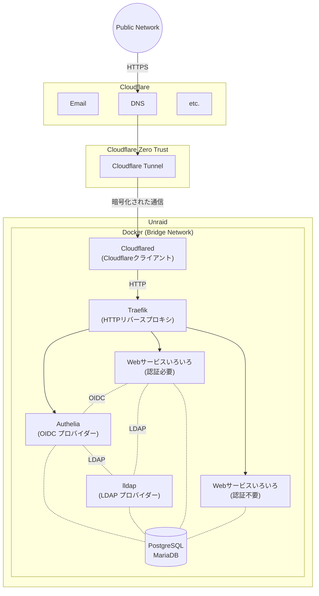

> この記事は、履歴書と職務経歴書の補足となるものです。  
> ぜひ、一度履歴書と職務経歴書をご覧いただいた上で、本記事をご覧いただけますと幸いです。
{: .prompt-tip }

職歴については、職務経歴書にて詳しく説明しましたが、  
ご承知の通り、ゲームクライアントエンジニアとしての5年間の経験は、インフラエンジニアに直接応用できる部分は限られているかもしれません。  
ただし、自分は趣味として自宅サーバーの運用を行っていますので、  
ぜひ私の自己研鑽の部分も紹介したいと思います。

> 記事の後半に、面接でよく聞かれる話をまとめたQ&Aもあります。
> 面接がよりスムーズにすすめられますよう、ご一読ください。
{: .prompt-tip }

## 自宅サーバー

数年前、Youtubeで自宅サーバーの動画を見て、興味を持ちました。  
そして、Raspberry PiとAWS EC2から始めて、Linux、Docker、VMなどを学びました。  
現在、自作PCで数十個のWebサービスを運用しています。  
趣味として始めたとはいえ、すべてのサービスにおいて、Production Readyレベルの安定性と安全性を追求して運用しています。  
今後は、この経験を活かして、インフラエンジニアとして働けたらと考えております。  
ぜひご指導ご鞭撻のほどよろしくお願いします。

### Overview

_Unraid OS_

[Unraid OS](https://unraid.net/)を使用しています。  
サービスは全部Docker Composeで運用しています。  

_現在運用しているサービス_

現在運用しているサービス：<https://home.forever17.me/>  
※一部ローカルからしかアクセスできないサービスを除く

### ネットワーク構造

#### 工夫したところ①：ネットワーク構成

数年前にネットワークの基礎知識はありましたが、実際の応用した経験はありませんでしたので、自宅サーバー構築の初期はよくネットワーク問題で困ってました。  
上記のネットワーク構成もここ数年何回も改造した結果、現在に至りました。

- 低コスト
  - 自宅サーバーのマシンと電気代以外コストなし
  - Cloudflareの無料プランしか使っていません
  - CDN、DDos保護、Tunnel全部無料
- 安全
  - [Cloudflare DNS Proxy](https://developers.cloudflare.com/dns/proxy-status/)を利用することで実際のサーバーIPが見れない
    - DDoS、AIロボットなども防げる
    - SSL/TLS証明書の管理とHTTPS通信もCloudflare側に全任せ
- SSOを利用してアカウント管理が簡単
  - サービスごとに認証システムがついていて、サービスごとにアカウント作成/管理が煩雑
  - SSOで統一すると、1アカウントですべてのサービスにログインできる
    - もちろん権限管理で使えるサービスと使えないサービスの設定もできる

#### 工夫したところ②：Webサービスの選定

- クラウドに保存したいファイルが数TBぐらいあるが、Google ドライブお高いので、安く済ませたい
  - Google ドライブと同じようにブラウザでWordとExcel直接編集できる
- 複数人同時編集できるWebホワイトボードがほしい
- IT仕事でよく使うツールをまとめたサイトがほしい
- PDF編集・作成・変換したい
- Google Photoは写真を圧縮するので、圧縮しない写真保存サービスがほしい
- GithubのLFSの無料枠が少ないので、セルフホストのGitサービスがほしい
- 買いたい商品がいつも在庫切れで、在庫自動チェックボットがほしいが、そのためだけにコード書きたくない
- 脳内保存の３つのパスワードを使いまわしているので、安全性高めるためにパスワード管理サービスがほしい
  - TOTPとPasskeyなどもサポートしてほしい
- 上記の訴求は全部可能の限り0円で済ませたい

まるで自分自身に対してITコンサルタントしているような気分で、
Githubで漁ったり、記事を読んだり、実際に動かして試したりして、
最終的に顧客（自分）のニーズに合わせたものを実装するという流れが普段の娯楽です。

> 参考サイト  
> <https://github.com/trending>  
> <https://www.reddit.com/r/selfhosted/>  
> <https://github.com/awesome-selfhosted/awesome-selfhosted>  
> <https://www.linuxserver.io/>  
{: .prompt-tip }

## 面接でよく聞かれるQ&A

### Q: 転職の理由はなんですか？

最大の理由は、成長を感じなくなったからです。  
5年間ずっと同じプロジェクトで働き、最初の3年間はとても勉強になったと思いますが、  
運営型のゲームですので、どうしても寿命が来てしまい、ここ2年は延命措置の実装しかしていません。  
2つ目の理由は、会社の経営不振です。  
この点について特に説明する必要もなく、前職の会社が希望退職を募集したという情報はニュースにも報道されました。  
３つ目の理由は、ゲーム業界全体に対して、将来性を感じません。  
ゲーム業界は狭く、会社数自体も少ない上、業界有名の会社でも近年ヒットする大作が少なくなり、  
現在の市場においては、中国や韓国のゲームが大きなシェアを占めている状況です。

### Q: なぜゲームエンジニアからインフラエンジニアになりたいですか？

前述の転職理由の3つ目が「ゲームエンジニア」を辞める理由で、  
そして前述の自宅サーバー趣味は「インフラエンジニア」になりたい理由です。  
やはり、興味の持てる物事を仕事にすることでモチベーションを維持できると考えており、  
その点でインフラエンジニアは私にとって最適な選択ではないかと考えております。

### Q: あなたの強みは何ですか？

ハードスキル

|技術スタック|熟練度|補足|
|:--|:--:|:--|
|Unity|★★★|UI、Asset、Gameplay、Build|
|C#|★★★|MVVM|
|Git|★★||
|Linux(Ubuntu)|★★||
|Docker|★★|実務経験少め、主に自宅サーバー|

※入門レベルの１★の部分を省く

ソフトスキル

- 幅広い知識
  - 経験のなさは知識でカバーするタイプ
- 自己研鑽の姿勢
  - 自己評価を重視し、毎年の目標は「去年の自分より強くなること」
  - 次の目標はAWS CAA-C03の資格
- コミュニケーションのわかりやすさを重視
  - 難しいものを説明するときいつも画像・動画・フローチャート付き（この記事がエビデンス）
- 問題を見つける力
  - 前職過去１年改善提案平均月１件

### Q: あなたの弱みは何ですか？

現時点での課題は、インフラエンジニアとしての実務経験と関連資格が不足している点です。  
ただし、持ち前の学習意欲と自己研鑽の姿勢を活かし、一日も早く貴社に貢献できるレベルへキャッチアップしていく自信があります。

### Q: 入社後、何をやりたいですか？/キャリアプランは？

インフラ設計・構築の仕事がしたいです。  
例えば「私が構築したインフラの安定性が高く、現時点○○○日間安定稼働中！」  
「インフラ構成を改善・最適化することで、○○○万円のコスト削減に貢献しました」  
といった成果から達成感を得たいと考えています。
  
キャリアプランについては以下の通りです:  

- 短期（1~2年）目標：
  - AWSのシニアレベルの熟練度
  - AWS認定資格の取得
- 長期（3~5年）
  - クラウドコンサルティング/クラウドアーキテクト

### Q: 最近気になっている技術は何ですか？

Kubernetes、Terraformです。  
自宅サーバーの規模だとk8sとTerraformの出る幕がないので、昔から気になってました。

### Q: 周りからどんな人だと言われますか？

上司から「新卒から5年間の進歩がすごい」と評価されたことがあります。  
ゲームテストチームから「はっきりと意見を言える力がある」と言われたことがあります。

### Q: 何か質問はありますか？

もしご縁をいただけた場合、私が配属される可能性のある部署の技術スタックや、チームの構成（人数、役割分担など）について、お伺いできますでしょうか？
